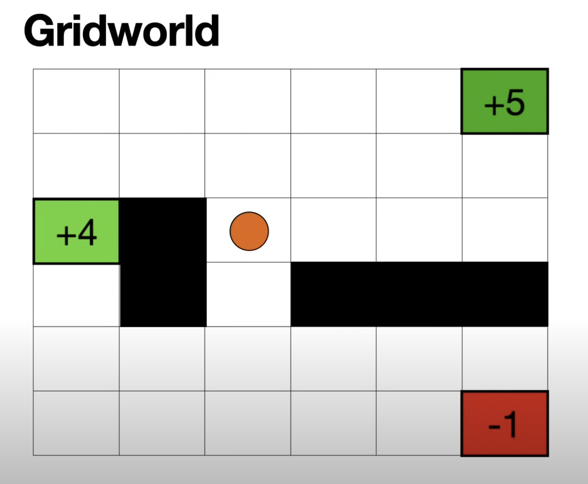

# Complete Guide to Proximal Policy Optimization (PPO)

## Introduction

Proximal Policy Optimization (PPO) is tremendously important in reinforcement learning and machine learning in general, especially nowadays, because PPO is the method used to train large language models.

Large language models are trained using something called Reinforcement Learning with Human Feedback (RLHF). RLHF consists of training a large language model by making it play a game. In this game, the model scores highly if humans rate it well, and the technique used in RLHF is proximal policy optimization.

## What We'll Learn

In this tutorial, we'll cover everything about proximal policy optimization. In short, PPO is very similar to other reinforcement learning methods where you have two neural networks: you train a value network and a policy network. What's special about PPO is that the value network and the policy network get trained at the same time.

We're going to learn three things:
1. The value neural network
2. The policy neural network
3. How to train them simultaneously

## The Grid World Environment

Let's introduce a grid world to understand the fundamentals. Here we have a grid and an agent that's going to walk around this grid. In this grid, some cells are special:
- Cell with lots of money (+5 points)
- Cell with money (+4 points)
- Cell with a dragon (-1 point if you get eaten)



There are barriers that you are not allowed to cross. The idea is that the game consists of the agent walking around the grid, moving up, down, left, or right. When it hits one of the special boxes, it gets that many points.

This grid world is the quintessential example of reinforcement learning, but you can think of many problems being solved using reinforcement learning: playing chess, playing Go, playing video games, robots learning to move, and most importantly, training large language models.

## States and Actions

### States
A state is very simple - it's any place where the agent can be. It cannot be on the barriers, but it can be on pretty much any cell on the grid. In other words, a state is any position where the game can be.

### Actions
Let's look at some square and say it has four neighbors. It can go up, down, left, and right - those are the four actions. The actions are basically the arrows where the agent could potentially move. We can tell the agent not to walk into walls, so we remove some arrows, leaving only the available actions for each state.

## Values

Let's look at a cell in the middle. If the agent is here, what do we know about the game? If the game is played well, we can reach a value of 5 from here. That means if I'm in this state, I can assign a value of 5 because it's the best I can reach from that place.

Let's make it more interesting by saying it costs one point to move one spot in this grid. If I'm at a spot where I can move to the 5, I earn 5 points but lose 1 from moving there, so the value here is 4. The value represents the maximum score I can achieve if I play as intelligently as possible from that position.

### Value Calculation Rule
If I have a box with four neighbors having values of 4, 1, -3, and 2, I obviously want to walk towards the 4 (the highest) and subtract 1 because it costs me 1 to get there. Therefore, the rule is:

**The value of a cell is the maximum of the values of the neighbors minus one.**

Using this rule, we can propagate through the cells and calculate all values.

## Policy

Let's go back to the first game where it was free to move around. If it's free to move, I always want to get to the 5 and never want to hit the other numbers. These arrows form what's called a policy.

When you charge one point for moving, a good policy would be to put an arrow pointing to the highest value among the neighbors. As long as I follow those arrows, I will always end up with the maximum number of points I can achieve at that particular cell.

## The Problem with Traditional Approaches

It seems like we solved the problem because we calculated the values and policy. With either one separately, we can win this game. What's the catch?

To calculate the values and policy, we had to:
1. Visit every square in the grid
2. Visit them several times because we needed to iterate and recalculate values until we got perfect values and policy

This isn't a problem when the grid is small, but imagine a grid with thousands of columns and rows. For such a grid, it's hard to visit every square, and even harder to visit them several times. This problem gets even harder with infinitely many states (like robot arm positions).

**Solution**: We need to approximate the value function using neural networks.

## Neural Network Approximation

### Value Neural Network
The idea is that a neural network gives us a continuous function for the value network. If we discover that the value on one square is high, the values on surrounding squares are probably high as well. We don't need to visit all squares - if we visit some of them, we can calculate the function for the rest using neural networks.

- **Input**: Coordinates of the state (X, Y)
- **Output**: What the neural network thinks the value is

### Policy Neural Network
Similarly, if we calculate a good policy for one state, the policy for neighboring states should be similar. We can approximate the policy with a policy neural network.

- **Input**: State coordinates
- **Output**: Four probabilities (up, right, down, left)

For example: 0.6 for up, 0.25 for right, 0.05 for down, 0.1 for left.

### Stochastic vs Deterministic Policy
This probabilistic policy is called a stochastic policy, and it's better than a deterministic policy because:

- **Deterministic policy**: Tells you exactly what to do but won't explore the space much
- **Stochastic policy**: Allows exploration of the space while still trying to get high scores

A stochastic policy balances explore vs exploit - it tries to get high scores but also allows exploration with small probability to improve values and policy.

## Training the Neural Networks

### Training the Value Neural Network

Here's the main idea: Let's say we have a state whose value the neural network thinks is 2, but the actual value is 5. The neural network underestimated, so we need to tell it to increase this value.

We introduce something called the gain:
```
Gain = Actual Value - Neural Network Value
```

In this case: `Gain = 5 - 2 = 3`

We use this gain as a loss function to train the neural network.

**The Process:**
1. Start at a position and walk around using the current policy neural network
2. Reach a terminal state and calculate actual values for the path
3. Compare neural network values with actual values
4. Use squared difference as loss function: `(Actual Value - NN Value)²`
5. Take the average of all squared differences
6. Use this loss to train the value neural network

**Mathematical Formula:**
```
Loss = E[(V(s) - R_t)²]
```

Where:
- E = Expected value (average)
- V(s) = Value neural network output for state s
- R_t = Actual values from the path

### Training the Policy Neural Network

The policy neural network training is similar but more complicated. Let's say we have two states and a policy that gives 0.2 probability of going from left state to right state.

If the value neural network thinks the right state value is 2, but the actual value is 5, there's a gain of 3. We need to:
1. Tell the value neural network to increase the value (as before)
2. Tell the policy neural network to increase the probability of getting to that state

### Momentum/Impulse Concept
There's a special ingredient: momentum. Think of a kid running:
- **Scenario 1**: Kid running right at velocity 10, we push right → velocity increases to 20
- **Scenario 2**: Kid running left, we push right → velocity decreases because we're pushing opposite to motion

The same applies to policy training:
- If probability has been increasing and we have positive gain → probability increases a lot
- If probability has been decreasing but we have positive gain → probability increases only slightly

### The Surrogate Objective Function
We encode momentum by taking the ratio of current probability to previous probability:

```
Surrogate Objective = (Current Probability / Previous Probability) × Gain
```

**Mathematical Formula:**
```
L^POLICY = π_θ(a|s) / π_θ_old(a|s) × A_t
```

Where:
- π_θ(a|s) = Current policy probability
- π_θ_old(a|s) = Previous policy probability
- A_t = Advantage (gain)

### The Clipping Mechanism
**Problem**: If probabilities change drastically, the ratio can become very large (like 4000), making training chaotic.

**Solution**: Clip the ratio to stay within a reasonable range.

We want the ratio to be close to 1, so we create a small radius around 1 (e.g., ±0.3):
- Minimum allowed ratio: 0.7
- Maximum allowed ratio: 1.3

**Clipping Rule:**
- If ratio < 0.7 → set it to 0.7
- If ratio > 1.3 → set it to 1.3
- If 0.7 ≤ ratio ≤ 1.3 → keep as is

**Final Clipped Objective Function:**
```
L^POLICY_CLIP = min(ratio × A_t, clip(ratio, 1-ε, 1+ε) × A_t)
```

Where ε is the clipping parameter (e.g., 0.3).

## The RLHF Pipeline at Scale

In practice, large language model training follows this structure:

### 1. Supervised Fine-tuning (SFT)
- 100K+ high-quality demonstrations
- Creates strong base model

### 2. Reward Model Training
- Millions of comparisons: "A is better than B"
- Often uses multiple reward models
- Handles edge cases, safety, helpfulness

### 3. PPO Training
- Batch sizes: 32K-128K tokens
- KL coefficient: Dynamically adjusted
- Early stopping based on reward hacking
- Multiple checkpoints for safety

### 4. Iterative Refinement
- Collect more human feedback
- Identify failure modes
- Retrain reward model
- Another PPO round

## PPO Implementation Details

### The PPO Epoch Structure
```python
for epoch in range(num_epochs):  # e.g., 3 epochs
    # Step 1: Generate NEW responses for all prompts
    # Step 2: Calculate rewards
    # Step 3: Calculate log probs for these sequences
    # Step 4: Update the model
    # Step 5: Store log probs for next epoch's ratio calculation
```

### Detailed Flow with Example

**Epoch 1:**
```python
# Generate responses for all 10 prompts
Prompt 1: "The food at the restaurant was" → "wonderful and I liked the..."
Prompt 2: "The movie I watched last night was" → "boring but had great effects..."
...
Prompt 10: "Customer support helped me" → "resolve my issue quickly..."

# Calculate and store log probs
old_log_probs = {
    "The food at the restaurant was": -2.644,  # avg log prob of "wonderful and I..."
    "The movie I watched last night was": -3.122,
    ...
    "Customer support helped me": -2.891
}
```

**Epoch 2:**
```python
# Generate NEW responses (they might be different!)
Prompt 1: "The food at the restaurant was" → "delicious and fresh..."  # Different!
Prompt 2: "The movie I watched last night was" → "amazing and well directed..."
...

# BUT! For ratio calculation, we need log prob of EPOCH 1's sequences
# So we ask: "What's the probability NOW of generating the OLD sequences?"

# Calculate current model's log prob for EPOCH 1's sequences:
new_log_prob_for_old_seq = calculate_log_prob(prompt, old_sequence)

# Calculate ratio for THIS specific pair
ratio = exp(new_log_prob_of_old_seq - old_log_prob)
```

### The Key Insight
PPO doesn't compare different sequences! It asks: "How has the probability of generating the SAME sequence changed?"

**Why This Way?**
- **Theoretical Reason**: PPO's math assumes we're comparing to the policy that collected the data (π_old)
- **Practical Reason**: If we kept updating the reference, we'd lose track of how much the policy has changed
- **Stability**: Using a fixed reference point prevents the policy from drifting too far

### Visual Summary:
1. **Experience Collection:**
   - Generate responses with current policy
   - Calculate log probs (these become π_old)
   - Calculate rewards

2. **PPO Training (multiple epochs):**
   - Epoch 1: ratio = π_current / π_old
   - Epoch 2: ratio = π_current / π_old (same π_old!)
   - Epoch 3: ratio = π_current / π_old (same π_old!)
   - Epoch 4: ratio = π_current / π_old (same π_old!)

Then collect NEW experiences and repeat...

### Calculating Ratios Individually
```python
# For EACH stored prompt-response pair
ratios = []
for prompt, data in storage.items():
    old_response = data['response']
    old_log_prob = data['old_log_prob']
    
    # Calculate what the CURRENT model thinks about this OLD response
    new_log_prob = calculate_log_prob(prompt, old_response)
    
    # Calculate ratio for THIS specific pair
    ratio = exp(new_log_prob - old_log_prob)
    
    ratios.append({
        'prompt': prompt,
        'response': old_response,
        'old_log_prob': old_log_prob,
        'new_log_prob': new_log_prob,
        'ratio': ratio
    })

# Results might be:
ratios = [
    {'prompt': "The food at...", 'ratio': 1.56},    # More likely now
    {'prompt': "The movie I...", 'ratio': 0.82},    # Less likely now
    {'prompt': "I feel really...", 'ratio': 1.23},  # More likely now
    {'prompt': "The service I...", 'ratio': 1.45},  # More likely now
    {'prompt': "The product...", 'ratio': 0.91}     # Less likely now
]
```

**Key Points:**
- Each prompt-response is independent: The ratio for prompt 1 has nothing to do with prompt 2
- Storage is per-prompt: We maintain separate log probabilities for each prompt-response pair
- Ratios are calculated individually: Each ratio only compares the same prompt-response pair across epochs

### Surrogate Objective Calculation
```python
# We have 5 examples
ratios = [1.72, 0.84, 1.21, 1.43, 0.82]
advantages = [0.8, -0.5, 0.3, 0.6, -0.9]

# Calculate surrogate objective for each
surrogate_objectives = []
for i in range(5):
    ratio = ratios[i]
    advantage = advantages[i]
    
    # Unclipped objective
    surrogate_unclipped = ratio * advantage
    
    # Clipped objective (ε = 0.2)
    ratio_clipped = clip(ratio, 0.8, 1.2)
    surrogate_clipped = ratio_clipped * advantage
    
    # Take minimum (pessimistic)
    surrogate = min(surrogate_unclipped, surrogate_clipped)
    surrogate_objectives.append(surrogate)

# Results:
# Example 1: min(1.72*0.8, 1.2*0.8) = min(1.376, 0.96) = 0.96
# Example 2: min(0.84*(-0.5), 0.84*(-0.5)) = -0.42 (no clipping)
# Example 3: min(1.21*0.3, 1.2*0.3) = min(0.363, 0.36) = 0.36
# Example 4: min(1.43*0.6, 1.2*0.6) = min(0.858, 0.72) = 0.72
# Example 5: min(0.82*(-0.9), 0.82*(-0.9)) = -0.738 (no clipping)
```

### Policy Loss Calculation
```python
# Average the surrogate objectives
policy_loss = -mean(surrogate_objectives)
# = -mean([0.96, -0.42, 0.36, 0.72, -0.738])
# = -0.2844

# Negative because we MAXIMIZE objective (minimize negative objective)
```

### Neural Network Update
```python
# The key part: How does this loss update the model?

# For each example, the gradient tells the model:
# Example 1: surrogate = 0.96 > 0
#    → INCREASE probability of "wonderful and I liked..."
#    → But clipped! Only increase by limited amount

# Example 2: surrogate = -0.42 < 0
#    → DECREASE probability of this response
#    → Not clipped, full update

# Example 3: surrogate = 0.36 > 0
#    → INCREASE probability slightly (was clipped)

# Example 4: surrogate = 0.72 > 0
#    → INCREASE probability (was clipped)

# Example 5: surrogate = -0.738 < 0
#    → DECREASE probability of this response
```

### Gradient Descent Implementation
```python
# This happens inside PyTorch
optimizer.zero_grad()

# Compute gradients
policy_loss.backward()
# This calculates ∂loss/∂θ for all model parameters θ

# Update parameters
optimizer.step()
# θ_new = θ_old - learning_rate * ∂loss/∂θ

# Model weights are now updated!
```

### What Changed in the Model?
After this update:
```python
# If we recalculate log probs for the same sequences:
# (This would be for monitoring, not part of training)

# Example 1 (positive surrogate, was clipped):
old_log_prob: -2.644 → new_log_prob: -2.0
# Model now MORE likely to generate "wonderful and I liked..."

# Example 2 (negative surrogate):
old_log_prob: -3.122 → new_log_prob: -3.4
# Model now LESS likely to generate this response

# Example 5 (large negative surrogate):
old_log_prob: -3.201 → new_log_prob: -3.8
# Model now MUCH LESS likely to generate this response
```

### The Complete Update Cycle
```
5 Ratios × 5 Advantages → 5 Surrogate Objectives
           ↓
    Apply Clipping
           ↓
Average to get Policy Loss
           ↓
    Backpropagation
           ↓
  Gradient Descent Step
           ↓
  Model Weights Updated
```

**Next**: Either Epoch 4 or Collect New Experiences

**Key Insight:**
The beauty of PPO is that:
- Positive advantages × ratio > 1 = Reinforce good behaviors more
- Negative advantages × ratio < 1 = Reduce bad behaviors more
- Clipping prevents any single update from being too large

This creates smooth, stable learning where the model gradually improves its text generation!

## Understanding Log Probabilities in Language Models

### Value Head Output vs Logits

**Value Head Output: 2.4532**
- **What it is**: A single scalar value representing expected future reward
- **Range**: Can be any real number (-∞ to +∞)
- **Purpose**: Estimates "how good is this state?"
- **No softmax needed**: It's already the final value

**Logits (from Language Model Head)**
- **What it is**: 50,257 raw scores (one per vocabulary token)
- **Range**: Can be any real number (-∞ to +∞)
- **Purpose**: Scores for "what token comes next?"
- **Needs softmax**: Must be normalized to get probabilities

### The Architecture Difference
```python
# The model has TWO heads:

# 1. Language Model Head (for generating text)
hidden_state → Linear(768, 50257) → logits[50257] → softmax → probabilities

# 2. Value Head (for estimating reward)
hidden_state → Linear(768, 1) → value (single number)
```

### What the Value Means
The value 2.4532 is saying:
"From this state, I expect the total future reward to be about 2.45"

This is used in advantage calculation: `A = actual_reward - value`

If actual reward is 3.0, then advantage = 3.0 - 2.4532 = 0.55 (better than expected!)

### Code Difference
```python
# Getting logits (for text generation):
outputs = model(input_ids)
logits = outputs.logits  # Shape: [1, seq_len, 50257]

# Getting value (for reward estimation):
outputs = model(input_ids)
value = outputs.value  # Shape: [1, seq_len, 1]
value = value.squeeze()  # Shape: [1] - just one number!
```

### Key Insight
The value head is learning a completely different task:
- **LM Head**: "What word comes next?" (classification over 50k tokens)
- **Value Head**: "How much reward will we get?" (regression to a single value)

That's why PPO trains both heads simultaneously - one learns to generate better text, the other learns to predict how good that text will be!

### Calculating Full Sequence Log Probability

**What We Calculate But Don't Directly Use:**
- Raw logits (-42.5719) - Just for educational display
- Token-by-token probabilities (0.76%) - Just for educational display
- Token-by-token log probabilities (-4.8779) - Just for educational display

**What PPO Actually Needs:**
The PPO algorithm only needs one number per generated sequence: the average log probability of the entire response.

```python
# This is what PPO actually uses:
full_log_prob = get_log_probs(policy_model, input_ids, response_only)
# Returns something like -3.2 (average across all tokens)
```

**Where It's Used:**
This average log probability is used to calculate the policy ratio:
```python
# In epoch 1:
old_log_prob = -3.2  # Probability of generating this sequence

# In epoch 2:
new_log_prob = -2.8  # Probability of generating same sequence

# Policy ratio (Luis Castillo's momentum):
ratio = exp(new_log_prob - old_log_prob) = exp(-2.8 - (-3.2)) = exp(0.4) = 1.49
```

This ratio is crucial for PPO's loss function:
```python
surrogate = ratio * advantage
loss = -min(surrogate, clip(ratio, 0.8, 1.2) * advantage)
```

**Why Show Token-by-Token Details Then?**
The detailed breakdown is purely educational to show:
- How text generation works
- Which tokens the model found likely/unlikely
- How confident the model was

But PPO doesn't need these details - it only cares about the overall sequence probability!

### Full Sequence Log Probability
This is the probability of generating the entire response (all tokens together), not just individual tokens.

**Example:**
```
Prompt: "The food at the restaurant was"
Generated: "wonderful and I liked the"  # 5 tokens
```

We need: P(generating "wonderful and I liked the" | "The food at the restaurant was")

**The Math:**
Since tokens are generated sequentially, the probability of the full sequence is:
```
P(full sequence) = P(token1) × P(token2|token1) × P(token3|token1,token2) × ...
```

For log probabilities:
```
log P(full sequence) = log P(token1) + log P(token2|token1) + log P(token3|token1,token2) + ...
```

**Step-by-Step Calculation:**
```python
# Position 6: After "was", predict "wonderful"
logits_after_was = logits[0, 5]  # 50257 values
log_prob_wonderful = log_softmax(logits_after_was)[7932]  # -4.88

# Position 7: After "was wonderful", predict "and"
logits_after_wonderful = logits[0, 6]  # 50257 values
log_prob_and = log_softmax(logits_after_wonderful)[290]  # -1.77

# Position 8: After "was wonderful and", predict "I"
logits_after_and = logits[0, 7]  # 50257 values
log_prob_I = log_softmax(logits_after_and)[314]  # -2.08

# And so on...

# Sum all log probabilities
total_log_prob = -4.88 + -1.77 + -2.08 + -3.76 + -0.73 = -13.22

# Average (what get_log_probs returns)
avg_log_prob = -13.22 / 5 = -2.644
```

**Why Average Instead of Sum?**
PPO uses average because:
- **Length normalization**: Longer sequences would always have lower total probability
- **Fair comparison**: Can compare sequences of different lengths
- **Stable training**: Prevents bias toward shorter responses

**What This Represents:**
The average log probability of -2.644 means:
- On average, each token had probability e^(-2.644) = 0.071 (7.1%)
- This is our measure of "how likely was this specific sequence"

**Used in Policy Ratio:**
```python
# Epoch 1: Model generates "wonderful and I liked the"
old_avg_log_prob = -2.644

# Epoch 2: For THE SAME sequence, calculate probability again
new_avg_log_prob = -2.2  # Model now more confident

# Ratio for PPO
ratio = exp(new_avg_log_prob - old_avg_log_prob) = exp(0.444) = 1.56

# The model is now 56% more likely to generate this sequence!
```

This ratio is what drives PPO's learning - it tells us how the policy has changed!

### The Key Concept: Autoregressive Generation
Transformers generate text one token at a time, where each token's probability depends on ALL previous tokens.

**The Setup**
```python
# Our full sequence
tokens = ["The", "food", "at", "the", "restaurant", "was", "wonderful", "and", "I", "liked"]
#         0      1       2     3      4             5      6            7      8   9      10
#         |--------------- prompt ------------------|----------- generated response -----------|
```

**How the Model Processes This**
When we feed the entire sequence to the model:
```python
outputs = model(full_ids)  # All 11 tokens
logits = outputs.logits    # Shape: [1, 11, 50257]
```

The model computes logits for EVERY position simultaneously:
```
logits[0, 0] = logits after seeing "The"
logits[0, 1] = logits after seeing "The food"
logits[0, 5] = logits after seeing "The food at the restaurant was"
etc.
```

### Position-by-Position Breakdown

**Position 6: Predicting "wonderful"**
```python
# The model has seen: "The food at the restaurant was"
# Position 5 contains logits for what comes AFTER "was"
logits_after_was = logits[0, 5]  # Shape: [50257]

# These logits represent P(next_token | "The food at the restaurant was")
# This is already a CONDITIONAL probability!

# Apply softmax to get probabilities
probs = softmax(logits_after_was)
log_probs = log_softmax(logits_after_was)
log_prob_wonderful = log_probs[7932]  # -4.88

# This is P("wonderful" | "The food at the restaurant was")
```

**Position 7: Predicting "and"**
```python
# Now the model has seen: "The food at the restaurant was wonderful"
# Position 6 contains logits for what comes AFTER "wonderful"
logits_after_wonderful = logits[0, 6]  # Shape: [50257]

# Note: This includes "wonderful" in the context!
log_probs = log_softmax(logits_after_wonderful)
log_prob_and = log_probs[290]  # -1.77

# This is P("and" | "The food at the restaurant was wonderful")
```

**Position 8: Predicting "I"**
```python
# Now the model has seen: "The food at the restaurant was wonderful and"
logits_after_and = logits[0, 7]  # Shape: [50257]
log_prob_I = log_softmax(logits_after_and)[314]  # -2.08

# This is P("I" | "The food at the restaurant was wonderful and")
```

### Visual Representation
```
Step 1: "The food at the restaurant was" → Model → P(? | context)
                                                    "wonderful": 0.8%
                                                    "good": 5%
                                                    "terrible": 0.3%
                                                    ...

Step 2: "The food at the restaurant was wonderful" → Model → P(? | context)
                                                              "and": 17%
                                                              ".": 25%
                                                              "!": 8%
                                                              ...
```

### The Magic of Attention
How does position 6 "know" about all previous tokens? Self-attention!
```
Position 6 attends to: [0:"The", 1:"food", 2:"at", 3:"the", 4:"restaurant", 5:"was"]
                       ↑       ↑        ↑     ↑      ↑           ↑
                       Creates a context vector that influences the logits at position 6
```

### GPT-2's Vocabulary Size: 50,257
This breaks down as:
- 50,000 base tokens (words, subwords, characters)
- 256 UTF-8 byte tokens (for handling any Unicode)
- 1 special token: `<|endoftext|>`
- Total = 50,257 tokens

**What This Means**
When the model predicts the next token, it outputs a score (logit) for EVERY possible token:
```python
logits[0, 5, :]  # Shape: [50257]
#
#                A score for each of the 50,257 possible tokens

# For example:
logits[0, 5, 0]    # Score for token "!"
logits[0, 5, 1]    # Score for token "."
logits[0, 5, 2]    # Score for token "#"
...
logits[0, 5, 7932] # Score for token "wonderful"
logits[0, 5, 8288] # Score for token "liked"
...
logits[0, 5, 50256] # Score for token "<|endoftext|>"
```

### The Full Shape
```python
logits = outputs.logits  # Shape: [1, 11, 50257]
#                                  ↑   ↑    ↑
#                                  │   │    │
#                              Batch Seq  Vocab
#                               Dim  Len  Size
```

### When I Write logits[0, 5]
I'm using shorthand. The full indexing is:
```python
logits[0, 5]       # SHORTHAND for logits[0, 5, :]
logits[0, 5, :]    # FULL notation - takes ALL 50,257 values at position 5
```

Both mean the same thing! The `:` means "take all values in that dimension".

### Breaking Down the Dimensions
```python
# logits has shape [1, 11, 50257]

# First index (batch dimension):
logits[0]          # Shape: [11, 50257] - all positions for first (only) batch

# Second index (position dimension):
logits[0, 5]       # Shape: [50257] - all token scores at position 5
logits[0, 5, :]    # FULL notation - takes ALL 50,257 values at position 5

# Third index (vocabulary dimension):
logits[0, 5, 7932] # Shape: scalar - single logit value for token "wonderful"
```

### Visual Representation
```
logits shape: [1, 11, 50,257]

Batch 0: [
  Position 0: [logit_for_token_0, logit_for_token_1, ..., logit_for_token_50256] # 50,257 values
  Position 1: [logit_for_token_0, logit_for_token_1, ..., logit_for_token_50256] # 50,257 values
  ...
  Position 5: [logit_for_token_0, logit_for_token_1, ..., logit_for_token_50256] # 50,257 values
  Position 6: [logit_for_token_0, logit_for_token_1, ..., logit_for_token_50256] # 50,257 values
  ...
  Position 10: [logit_for_token_0, logit_for_token_1, ..., logit_for_token_50256] # 50,257 values
]
```

### The Indexing Examples
```python
# Get ALL logits at position 5 (after "was")
logits_after_was = logits[0, 5]        # Shape: [50257]
# OR equivalent:
logits_after_was = logits[0, 5, :]     # Shape: [50257]

# Get specific logit for "wonderful" at position 5
wonderful_logit = logits[0, 5, 7932]   # Shape: scalar (single number)

# Apply softmax to all 50,257 logits at position 5
log_probs = log_softmax(logits[0, 5])  # Input shape: [50257], Output shape: [50257]

# Get log probability for "wonderful"
log_prob_wonderful = log_probs[7932]   # Single value: -4.88
```

### Complete Example
```python
# Starting with
logits  # Shape: [1, 11, 50257]

# Position 5 (after "was"):
all_logits_at_pos_5 = logits[0, 5]                    # Shape: [50257]
log_probs_at_pos_5 = log_softmax(all_logits_at_pos_5) # Shape: [50257]
log_prob_of_wonderful = log_probs_at_pos_5[7932]      # Scalar: -4.88

# Position 6 (after "wonderful"):
all_logits_at_pos_6 = logits[0, 6]                    # Shape: [50257]
log_probs_at_pos_6 = log_softmax(all_logits_at_pos_6) # Shape: [50257]
log_prob_of_and = log_probs_at_pos_6[290]             # Scalar: -1.77
```

Each ratio is completely independent and specific to its prompt-response pair!

### Greedy vs Sampling in Text Generation

**Greedy Decoding (NOT what we're using)**
```python
# If we were doing greedy decoding:
logits_after_was = logits[0, 5, :]      # Shape: [50257]
next_token_id = torch.argmax(logits_after_was)  # Pick highest logit
# This ALWAYS picks the most likely token
```

**Sampling (What we're actually using)**
```python
# In the actual code:
response_ids = policy_model.generate(
    input_ids=input_ids,
    max_new_tokens=20,
    pad_token_id=tokenizer.eos_token_id,
    do_sample=True,        # ← This enables sampling!
    temperature=1.0
)
```

With `do_sample=True`, the process is:
```python
# 1. Get logits for all tokens
logits_after_was = logits[0, 5, :]  # [50257 values]

# 2. Convert to probabilities
probs = softmax(logits_after_was / temperature)

# 3. Sample from the probability distribution
next_token = torch.multinomial(probs, num_samples=1)

# This means:
# - "good" with 5% probability might get selected 5% of the time
# - "wonderful" with 0.8% probability might get selected 0.8% of the time
# - Even low probability tokens can be chosen!
```

**Example with Real Numbers**
```python
# After "was", the logits might be:
logits = {
    "good": 2.5,      # Highest logit
    "great": 2.3,
    "excellent": 2.1,
    "wonderful": -0.5,  # Lower logit
    "terrible": -3.0,   # Very low logit
    ... # 50,252 more values
}

# Convert to probabilities:
probs = {
    "good": 0.35,       # 35% chance
    "great": 0.28,      # 28% chance
    "excellent": 0.20,  # 20% chance
    "wonderful": 0.008, # 0.8% chance (but still possible!)
    "terrible": 0.001,  # 0.1% chance
    ...
}

# With sampling:
# - 35% of the time we'll pick "good"
# - 28% of the time we'll pick "great"
# - 0.8% of the time we'll pick "wonderful" ← This is what happened!
```

**Why Sampling Instead of Greedy?**
- **Exploration**: PPO needs to explore different options to learn
- **Diversity**: Always picking the highest logit leads to repetitive text
- **Stochastic Policy**: Luis Castillo emphasized stochastic > deterministic

**Temperature Effect**
```python
temperature=1.0  # What we're using

# Higher temperature (e.g., 2.0) → More random, flatter distribution  
# Lower temperature (e.g., 0.5) → Less random, sharper distribution
# Temperature → 0 approaches greedy decoding
```

So yes, we have 50,257 logit values, but we're randomly sampling based on the probability distribution, not just picking the maximum! This is why we sometimes see low-probability tokens like "wonderful" (0.8%) being selected.

## Summary

That's Proximal Policy Optimization! You have:

1. **Value Neural Network**: Approximates values, trained using the squared difference loss function
2. **Policy Neural Network**: Approximates policy, trained using the clipped surrogate objective function with momentum

Both networks are trained simultaneously, which is what makes PPO special and effective.

PPO is a sophisticated algorithm that balances several key concepts:
- **Exploration vs Exploitation** through stochastic policies
- **Stability vs Progress** through probability ratio clipping
- **Sample Efficiency** by reusing data across multiple epochs
- **Robustness** by preventing large policy updates

The algorithm's success in training large language models demonstrates its effectiveness at handling complex, high-dimensional problems while maintaining stable learning dynamics.
